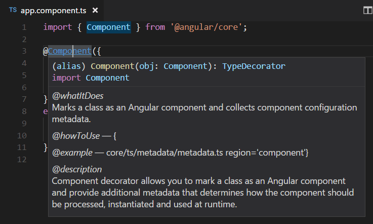
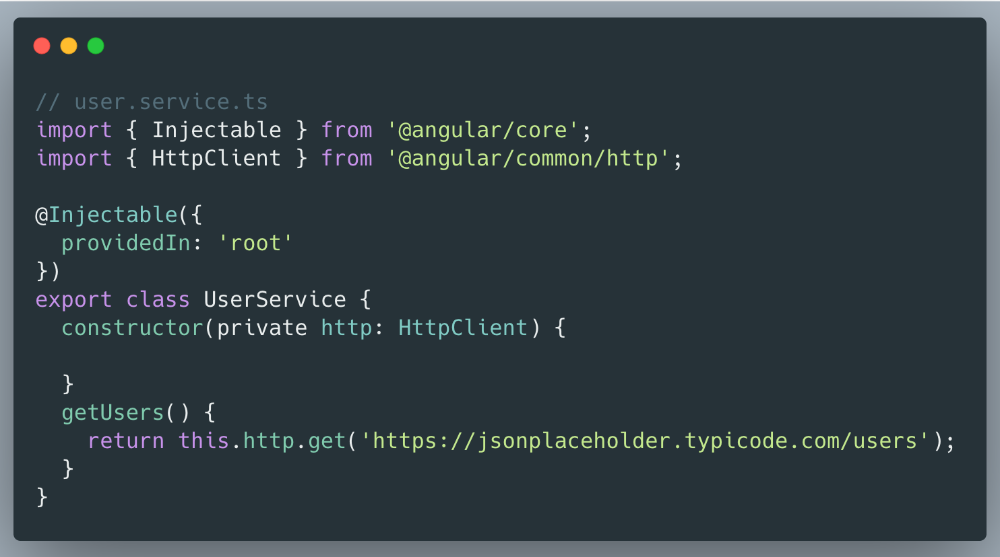

# Angular


## Instalacija

Najbrži i najefikasniji način za kreiranje i razvijanje Angular aplikacija je putem **Angular CLI** (CLI - Interfejs komandne linije). Instaliranje CLI se može izvršiti u terminalu pomoću [npm](https://docs.npmjs.com/) paket menažera:
```
npm install -g @angular/cli
```

## Kreiranje projekta

**Visual Studio Code** je dobar izbor za razvoj Angular projekta pošto podržava Angular IntelliSense i navigaciju u kodu, kao i neke dodatne ekstenzije. Nove projekte pravimo u trenutnom direktorijumu pomoću komande:

```
ng new moja-app
```

"moja-app" će biti naziv foldera u kome će se nalaziti svi fajlovi i folderi vaše aplikacije.

Da bi pokrenuli naš web server i otvorili kreirani projekat u pretraživaču, potrebno je uneti komandu:

```
ng serve
```

## Osnovni elementi

 ### Komponenta 



 Komponente su gradivni blokovi koji čine našu aplikaciju. Sadrže TypeScript klasu uz @Component dekorator koji ima osnovne informacije o:
 
 * selektoru - kako će komponenta u html-u biti pozvana
 * templejtu - html komponente
 * stilu - css ili neki drugi stil koji će biti primenjen na komponentu

Kreiranje komponente je najjednostavnije pomoću komande:

```
ng generate component ime-komponente
```

U app.component.ts fajlu se nalazi naša root komponenta.

### Zavisnosti (Dependency injection)

Dependency injection nam dozvoljava da deklarišemo zavisnosti u naše TS klase bez potrebe da ih instanciramo. To odradi Angular za nas. 



 ## Preuzimanje podataka sa servera

[HttpClient](https://angular.io/api/common/http/HttpClient) je mehanizam u Angularu pomoću kog komuniciramo sa udaljenim serverom.

Da bi olakšali sebi rad, najbolje je da bude dostupan u celoj aplikaciji, tako da ga dodajemo u app.module.ts fajl:

```typescript
import { HttpClientModule } from '@angular/common/http';
```

Takođe ga dodajemo u NgModule:

```typescript
@NgModule({
  imports: [
    HttpClientModule,
  ],
})
```

 ### Kreiranje servisa
 
 Komponente ne treba da uvoze i čuvaju podatke, već je njihov fokus da ih prikazuju. Taj posao se delegira servisima.

 Kreiramo servis koji će nam služiti za dopremanje podataka pomoću komande:
 
```
ng create service ime-servisa
```
Kada napravimo servis, bitno je da ga dodamo i u NgModule:

```typescript
@NgModule({
  providers: [ ImeServisaService ],
})
```

### Dodavanje API metoda servisu

```typescript
export class ListApiService {

  readonly listAPIUrl = "https://localhost:7127/api";

  constructor(private http:HttpClient) { }

  getList():Observable<any[]>{
    return this.http.get<any>(this.listAPIUrl + '/ToDoLists');
  }

  addTask(data:any)
  {
    return this.http.post(this.listAPIUrl + '/ToDoLists',data);
  }
  updateTask(id:number, data:any)
  {
    return this.http.put(this.listAPIUrl + `/ToDoLists/${id}`,data);
  }
  deleteTask(id:number)
  {
    return this.http.delete(this.listAPIUrl + `/ToDoLists/${id}`);
  }
  
}
```
Promenljiva **listAPIUrl** sadrži informaciju gde na webu se nalazi naš server. Važno je proslediti konstruktoru HttpClient preko koga će se pozivati i vršiti HTTP zahtevi.

Ostaje još da komponente koje će prikazivati podatke importuju servis, dobijaju podatke pozivanjem metoda servisa i vizualizuju ih.


