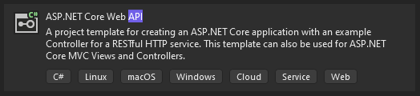

# .NET

## Kreiranje projekta

Kreiranje projekta u okviru radnog oruzenja Visual Studio je jednostavno i intiutivno. Samim kreiranjem projekta Visual Studio nam daje da biramo njegovu vrstu. Ovde je bitno izabrati opciju sa slike, C# [ASP.NET](http://ASP.NET) Core Web API.



Kreiranje projekta pomocu komandne linije se vrsi sledecim instrukcijama

```csharp
dotnet new webapi
```

## Struktura projekta


- Dependencies - tu se nalaze svi paketi i framework-ovi koje koristimo u izradi APIa
- Properties - podesavanje projekta,port itd
- Controllers - kontroleri su klucna stvar u ovakvoj izradi .NET APIa i sluze da regulisu http zahteva napravljena nasem APIu.

```csharp
using System;
using System.Collections.Generic;
using System.Linq;
using System.Threading.Tasks;
using Microsoft.AspNetCore.Mvc;
using backend.Models;

namespace backend.Controllers
{

    [Route("api/[controller]")]
    public class CardController:ControllerBase
    {
        private readonly DataContext dataContext;

        public CardController(DataContext dataContext)
        {
            this.dataContext = dataContext;
        }

        [HttpGet]
        [Route("getCards")]
        public async Task<ActionResult<List<Card>>> getCards(){

            return Ok(await this.dataContext.kartice.ToListAsync());
        }

        [HttpDelete]
        [Route("deleteCard")]
        public async Task<ActionResult<List<Card>>> deleteCard(int id){

            var kartica=await this.dataContext.kartice.FindAsync(id);
            if(kartica==null){
                return BadRequest("not find");
            }
            else{
                this.dataContext.kartice.Remove(kartica);
                await this.dataContext.SaveChangesAsync();
                    return Ok("Its okey");
            }

          }

        [HttpPost]
        [Route("insertCard")]
        public async Task<ActionResult<List<Card>>> insertCard(Card c){
                this.dataContext.kartice.Add(c);
                await this.dataContext.SaveChangesAsync();

            return Ok(await this.dataContext.kartice.ToListAsync());
        }

    }
}
```

primer kontrolera koji obradjuje osnovne http zahteve.

- appsettings.json je fajl u kojem se cuvaju neke od konfiguracija naseg projekta kao na primer connection string itd.
- Program.cs sluzi za samo buildovanje kao i pokretanje aplikacije

## Instaliranje paketa

U samom Visual Studiu instaliranje pakete se radi NuGet package managera. Desnim klikom na projekat dobijemo sledece opcije, i izaberemo Manage NuGet Packages... opciju.


Instaliranje paketa pomocu komandne linije se vrsi sledecim komandama.

```csharp
dotnet tool install --global dotnet-ef
```

Nakon instaliranja paketa globalno, potrebno je i dodati ga aktivni projekat. 

```csharp
dotnet add package Microsoft.EntityFrameworkCore.Design
```

## Pokretanje projekta

Samo pokretanja projketa u Visual Studiu se vrsim klikom na jedno dugme. 


Dok projekat radi, vatrica oznacava da je HotReloading ukljucen, sto znaci da prilikom snimanje projekta projekat ce se ponovo pokrenuti sam u pozadini. 


Preko komandne linije ovo se postize sledecim instrukcijama
 

```csharp
dotnet build
dotnet run
```

Ili ako zelimo HotReloading opciju samo..

```csharp
dotnet watch
```

## HTTP zahtevi

Realizovanje http zahteva je kljuc rada jednog APIa. U .NETu se to izvrsava unutar odgovarajucih kontrolera. Na primer, ako bi zeleli da imamo neki login/register usera trebalo bi to da realizujemo u nekom UserController.cs klasi, ako bi zeleli da realizujemo dodavanje,brisanje izmenu nekih na primer platnih kartica to be realizovali u CardController.cs klasi. 

```csharp
				[HttpGet] //oznacava da sledeca meteda regulise neku vrstu GET zahteva
        [Route("getCards")] //ruta na koju se vrsi GET zahtev
        public async Task<ActionResult<List<Card>>> getCards(){
						

						//Task<ActionResault<t>> genericka promenljiva oznacava sta nama vraca ova get
						// ruta, u ovom slucaju listu platnih kartica
            return Ok(await this.dataContext.kartice.ToListAsync());
        }
```