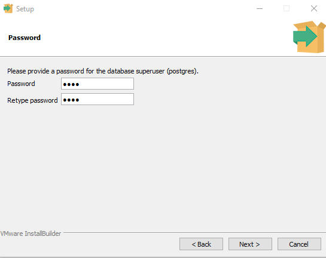
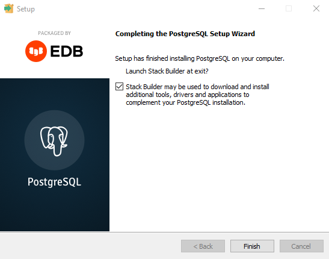
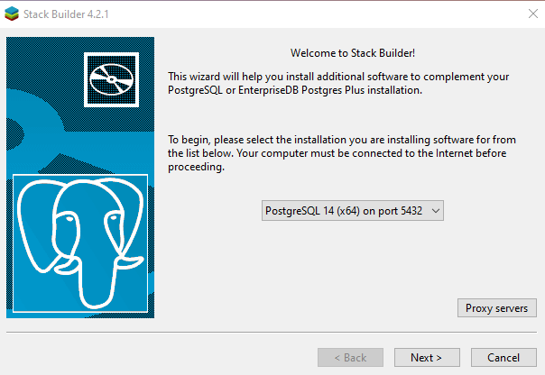
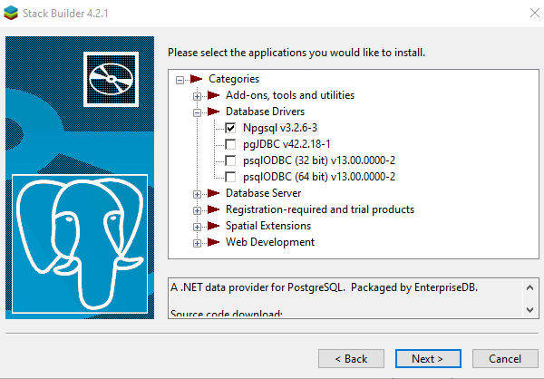

# Reference

Sadržaj
1. [Git](#git)
    1. [Komande za proveru trenutnog stanja](#komande-za-proveru-trenutnog-stanja)
    2. [Ispravka greške na lokalnoj grani pomoću remote grane](#ispravka-gre%C5%A1ke-na-lokalnoj-grani-pomo%C4%87u-remote-grane)
    3. [Brisanje poslednjeg commit-a](#brisanje-poslednjeg-commit-a)
    4. [Pomeranje vrha grane na neki prethodni commit](#pomeranje-vrha-grane-na-neki-prethodni-commit)
    5. [Prebacivanje lokalnih promena sa jedne grane na drugu](#prebacivanje-lokalnih-promena-sa-jedne-grane-na-drugu)
    6. [Poređenje dve verzije projekta](#pore%C4%91enje-dve-verzije-projekta)
2. [Angular](#angular)
   1. [Instalacija angular-a](#instalacija-angular-a)
   2. [Konfiguracija angular-a](#konfiguracija-angular-a)
3. [PostgreSQL](#postgresql)
    1. [Instalacija postgresql-a](#instalacija-postgresql-a)
    2. [Konfiguracija postgresql-a](#konfiguracija-postgresql-a)
    3. [Korisne komande](#korisne-komande)
4. [.NET](#net)
   1. [Konfiguracija .NET-a](#konfiguracija-net-a)
   2. [Entity Framework](#entity-framework)
5. [ANN mikroservis](#ann-mikroservis)
   1. [Instalacija mikroservisa](#instalacija-mikroservisa)
   2. [Pokretanje mikroservisa](#pokretanje-mikroservisa)
   3. [pipenv](#pipenv)

## Git

Ono što je bitno napomenuti je da postoje 3 bitna dela na koja treba obratiti pažnju: **origin** (remote), **staging area** i **working tree** (lokalni repo). 

**Origin** predstavlja repozitorijum na udaljenom računaru.

**Staging area** predstavlja nešto kao skup u koji se dodaju trenutna stanja nekih fajlova (snapshot) koji će biti deo sledećeg commit-a.

**Working tree** predstavlja lokalni repozitorijum, tj. lokalno stanje git projekta. Na njemu se nalaze sve lokalne promene koje je potrebno dodati u staged area kako bi bile commit-ovane.

### Komande za proveru trenutnog stanja

Prikaz informacija o trenutno odabranoj grani, broj commit-ova u odnosu na odgovarajuću remote granu, staged promene kao i lokalne promene:
```
git status
```

Skraćena forma prethodne komande koja sadrži samo jednostavne informacije o staged i lokalnim promenama, i te informacije govore o tome da li je fajl kreiran, dodat, izmenjen ili obrisan:
```
git status -s
```

Prikazuje informacije o commit-ovima od poslednjeg ka ranijim, a takođe je moguće videti na kojem commit-u se nalaze vrhovi grana:
```
git log
```

Skraćena verzija prethodne komande koja omogućava pregledniji prikaz sa početnim delom hash-a, title-om commit-a i lokacijom vrhova grana:
```
git log --oneline
```

### Ispravka greške na lokalnoj grani pomoću remote grane

Vraćanje lokalne `grana` grane na poslednji commit remote grane `grana`:
```
git fetch origin
git reset --hard origin/grana
```
  
[**Vrati se na početak^**](#reference)
  
### Brisanje poslednjeg commit-a

Brisanje poslednjeg commit-a sa lokalne i remote grane `grana`:
```
git reset HEAD^                 # remove commit locally
git push origin +HEAD           # force-push the new HEAD commit
```


Brisanje poslednjeg commit-a sa remote grane `grana` (uz čuvanje commit-a na lokalnoj grani):
```
git reset HEAD^                 # remove commit locally
git push origin +HEAD^:grana
```

### Pomeranje vrha grane na neki prethodni commit


Postavljanje `HEAD`-a na neki commit `ab12cd34` (ne mora da bude hash). Staged changes se brišu, ali lokalne promene ostaju:
```
git reset ab12cd34
```
**Note**: `--mixed` je default-ni switch, tj. prethodna komanda je ekvivalentna komandi `git reset --mixed ab12cd34`


Postavljanje `HEAD`-a na neki commit `ab12cd34` (ne morada bude hash) bez promene na lokalnom ili remote stablu:
```
git reset --soft ab12cd34
```


Postavljanje `HEAD`-a na neki commit `ab12cd34` (ne morada bude hash). I lokalne i staged changes se brisu
```
git reset --hard ab12cd34
```

### Prebacivanje lokalnih promena sa jedne grane na drugu

```
git stash
git checkout branch-name
git stash apply
```

### Poređenje dve verzije projekta

Poređenje poslednjeg commit-a sa poslednjim commit-om na remote grani `grana`:
```
git diff HEAD origin/grana
```


[**Vrati se na početak^**](#reference)

## Angular

### Instalacija angular-a

1. `cd src/frontend`
2. `npm install .`
3. `npm install ag-grid-angular ag-grid community`
4. `ng serve --open`

### Konfiguracija angular-a
Port: `4200

## PostgreSQL

### Instalacija postgresql-a

Za instalaciju PostgreSQL-a je potrebno ispratiti sledeći niz koraka. Koraci koji nisu navedeni se vrše odabirom podrazumevanih vrednosti/akcija.

1. Preuzeti [instalacioni fajl](https://www.postgresql.org/download/) (verzija `14.2`)
2. Za password odabrati `root`  
   
3. Checkbox za launch Stack Builder-a **treba** da ostane čekiran  
   
4. Nakon pokretanja Stack Builder-a potrebno je odabrati opciju sa slike  
   
5. U kategoriji _Database Drivers_ odabrati opciju **Npgsql v3.2.6-3**  
   
6. Nakon završetka svih instalacija instalacija PostgreSQL-a je završena, potrebno je samo izvršiti migracije kako bi se formirala šema baze

Kreiranje i ažuriranje baze iz NuGet terminala: 
```Update-Database```

Ukoliko postoji više context-a (što je već slučaj i trenutku pisanja ovog teksta) koristiti:
```Update-Database -Context NazivContext```
(ovo se vrši za svaki context koji je korišćen u okviru projekta)

Do NuGet terminala se može doći na sledeći način:  
`Tools > NuGet Package Manager > Packer Manager Console`


**NAPOMENA**: Ukoliko komanda `Update-Database` ne radi, koristiti `EntityFrameworkCore\Update-Database`

[**Vrati se na početak^**](#reference)
### Konfiguracija postgresql-a

User: `postgres`  
Password: `root`  
Port: `5432`  

### Korisne komande

`\du` - prikazuje sve role-ove (korisnike)  
`\l` - prikazuje listu svih baza podataka  
`\c ImeBaze` - povezivanje na bazu `ImeBaze`  
`\dt` - prikaz liste tabela  
`\quit` - izlazam iz PostgreSQL shell-a  

[**Vrati se na početak^**](#reference)


## .NET
### Konfiguracija .NET-a
Port: `7220`
### Entity Framework

`dotnet-ef migrations add Ime` - Dodavanje nove migracije  
`dotnet-ef migrations add Ime -Context ImeContexta` - Dodavanje nove migracije u okviru nekog konteksta  
`dotnet-ef migrations list` - Prikaz svih migracija (naziv kreće nakon karaktera `_`)  
`dotnet-ef migrations remove` - Brisanje poslednje migracije    

## ANN mikroservis

**Bitno**: sve pakete je potrebno instalirati pomoću `pipenv`, a ne preko `pip`-a. Ukoliko se to ne uradi, paketi instalirani na taj način neće biti razmatrani tokom instalacije svih paketa iz okruženja jer se neće naći na listi potrebnih paketa pa će doći do greške o nedostatku potrebnog paketa kada se program pokrene.

Kada dođe do promene okruženja (paketa) i kod bude spreman da ide u produkciju potrebno je izvršiti komandu `pipenv lock` kako bi se izvršilo ažuriranje svih informacija. Time se obezbeđuje da se dobije isto okruženje kada se bude vršila instalacija u produkciji.

### Instalacija mikroservisa
1. `pip install pipenv`
2. `cd .\src\ann-microservice`
3. `pipenv install`

### Pokretanje mikroservisa
1. `cd .\src\ann-microservice`
2. `pipenv shell`
3.
   1. `pipenv run server` - za produkciju
   2. `pipenv run dev_server` - za development

### pipenv

`Pipfile` je zamena za `requirements.txt`.  
`Pipfile.lock` omogućava determinističke build-ove. Komandom `pipenv lock` kreira se snapshot svih verzija paketa koji se koriste u nekom okruženju (daje sličan rezultat kao komanda `pip freeze`)

Neke od bitnih komandi:
* `pipenv install` - instalira potrebe pakete i dependency-e koji su definisani u `Pipfile`
* `pipenv install --dev` - instalira potrebe pakete i dependency-e koji su definisani u `Pipfile` zajedno sa paketima koji se samo koriste za development
* `pipenv install ime-paketa` - instalira navedeni paket u virtuelno okruženje
* `pipenv install ime-paketa --dev` - instalira navedeni paket u virtuelno okruženje i postavlja ga u dev sekciji u fajlu `Pipfile`
* `pipenv uninstall ime-paketa` - briše navedeni paket iz virtuelnog okruženja
* `pipenv --venv` - štampa lokaciju virtuelnog okruženja
* `pipenv lock` - pravi snapshot okruženja; koristi se kada je stanje okruženja potrebno sačuvati jer će ići u produkciju
* `pipenv sync` - instalacija paketa (radi se u fazi produkcije umesto `pipenv install`)
* `pipenv run ime-skripte` - pokreće skriptu koja je definisana u `Pipfile`
* `pipenv shell` - aktiviranje virtualnog okruženja

[Više o pipenv](https://codedamn.com/news/python/how-to-use-pipenv-to-manage-your-python-projects)

[**Vrati se na početak^**](#reference)
